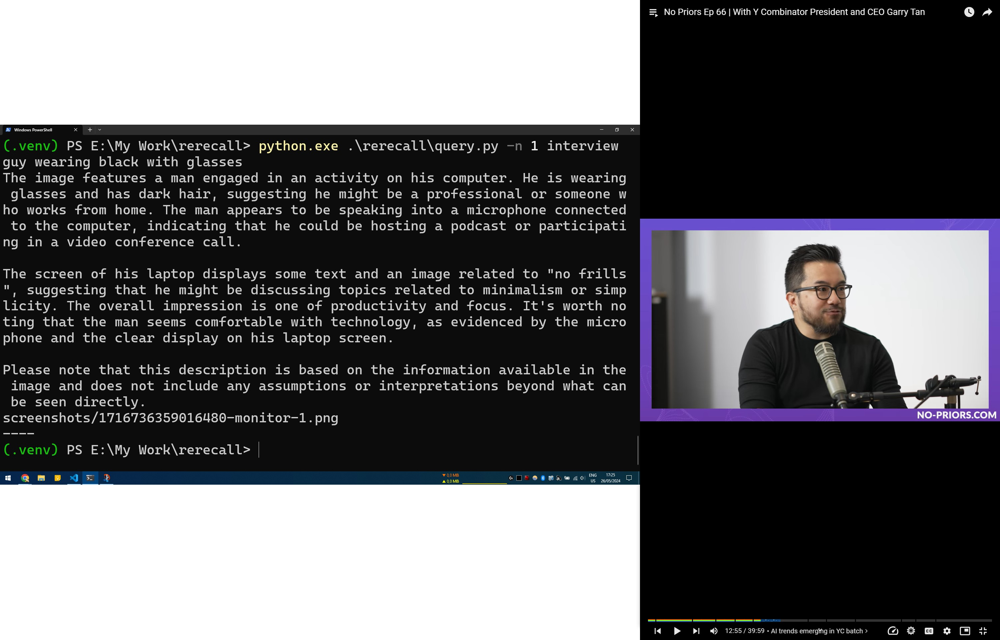

# ReRecall

ReRecall is a proof of concept for an open source implementation of Microsoft's Recall feature. It periodically takes screenshots of the user's desktop and stores them in a database. The user can then search through these screenshots using a text query.

**THIS IS A PROOF OF CONCEPT, EXPECT A LOT OF PROBLEMS.**


### Requirements

You need a modern python version and a docker installation with GPU support, the `docker-compose.yml` file is configured for nvidia gpus. I have ran this on a Windows 10 with a GTX 1060. No part of the code is os-specific so it should work fine on other systems. Feel free to play around.

### Setup


Clone the repository

```bash
git clone https://github.com/AbdBarho/ReRecall.git
cd ReRecall
```

Start Ollama
```bash
docker compose up -d
```

After the container downloads and starts, setup a virtual environment and install the requirements

```bash
python -m venv .venv
source .venv/bin/activate
# or .\.venv\Scripts\Activate.ps1 on Windows Powershell
pip install -r requirements.txt
```

Now you can start the recording
```bash
python rerecall/record.py
```
By default it will capture screenshots of all monitors every 60 seconds, see `rerecall/config.py` for all options you can change.


### Search

After recording some data, you can search through it using the search script

```bash
python rerecall/query.py -n 1 my search query
```
where `-n 1` is the number of results you want to see, and `my search query` is the text you want to search for.


### Notes


The current implementation is very primitive, it takes screenshots, uses `ollama/llava-phi3:3.8b-mini-q4_0` to generate descriptions of the screenshots, and uses `ollama/mxbai-embed-large` to generate embedding for vector search, and stores them in a chroma db database.

For the search part, the embedding is done on the query text and matches against existing embeddings in the database.

You can change the models used for the description and embedding in `rerecall/config.py`.

There is definitely room for improvement here:
* There are plenty of hallucinations in the generated descriptions, this could be a combination of the size the MLLM used to generate the descriptions (I use a very small model because I have a rusty 1060), or because the screenshots are very high in resolutions (no resizing is done, after a screenshot).
* The search is very basic, it just matches the embeddings of the query text with the embeddings of the screenshots, a potential improvement could be to use the model to enrich the user query with more information before embedding it for search.

### Results

Cherry picked, ignore the vertical monitor.


